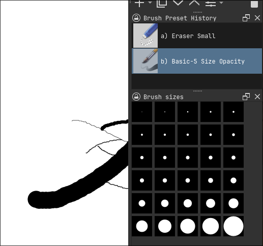

# Krita Brush Sizes Docker Plugin

This simple plugin adds a docker with predefined brush sizes that can be easily toggled.

Plugin screenshot: 



## Installation

1. Clone or [download](https://github.com/hruboson/krita-brush-sizes-docker/archive/refs/heads/main.zip) this repository.
1. Extract the `brush-sizes-docker/` folder and `brush-sizes-docker.desktop` file into your Krita plugin directory.
    1. **On Windows:** `%APPDATA%\krita\pykrita\` (or `C:\Users\USERNAME\AppData\Roaming\krita\pykrita`)
    1. **On Linux:** `~/.local/share/krita/pykrita/`
    1. Declaratively on NixOS - see my [config](https://github.com/hruboson/nixos-conf/blob/main/parts/programs/krita/default.nix). Use this repo as a flake input. Then just copy the folder and .desktop file using home-manager into the `~/.local/share/krita/pykrita`
1. Restart Krita.
1. Go to **Settings -> Configure Krita -> Python Plugin Manager** and enable the plugin.
1. *(optional) You may need to restart Krita again.*
1. Show the docker by toggling **Settings -> Dockers -> Brush sizes**

> [!TIP]
> You can also find the plugin folder directly in Krita by going to **Settings -> Manage Resources -> Open Resource Folder**, then opening (or creating) the `pykrita` subfolder inside it.
 
## Planned features

- Configure your own brush sizes through Krita settings
- Icon buttons use the actual brush texture
- Development version where the `nix develop` creates a symlink with different name than the actual plugin

## Development

I used [nix](https://nixos.org/download.html#nix-install-linux) while developing this plugin but it is not necessary. You will just need a working python environment with PyQT5/6 environment ready.

- Using Nix:
  - `nix develop` to get into the development environment AND **create links in krita plugin directory** to this project directory.
    - If you installed this plugin before development, it is advised to remove it before running `nix develop`.

- Install Nix on your distribution:
  - **Fedora:** `sudo dnf install nix`
  - **Arch:** `sudo pacman -S nix`
  - **Debian/Ubuntu/Other:** Use the [official Nix installer](https://nixos.org/download.html#nix-install-linux):
    ``` bash
    curl -L https://nixos-nix-install-tests.cachix.org/serve/i6laym9jw3wg9mw6ncyrk6ajjxwab5dg00eb0nw80h9d7qqh7ja/install | sh -s -- --daemon
    ```
  - After installation, reload your shell or run `source $HOME/.nix-profile/etc/profile.d/nix.sh`
